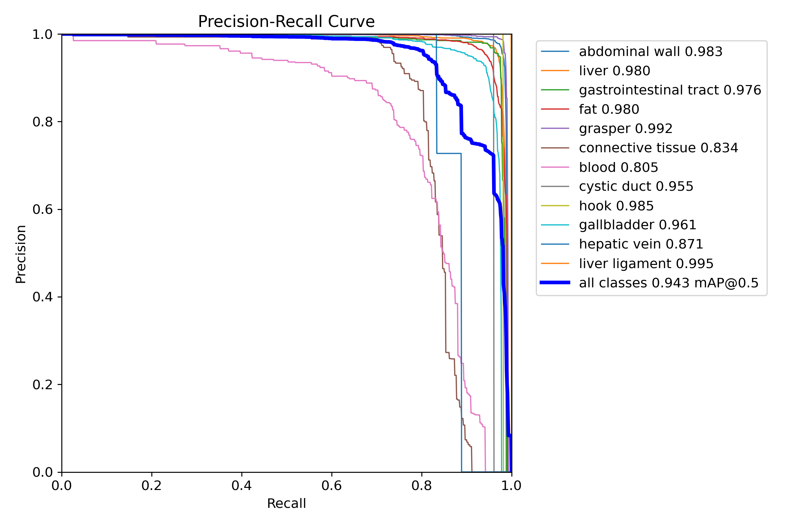
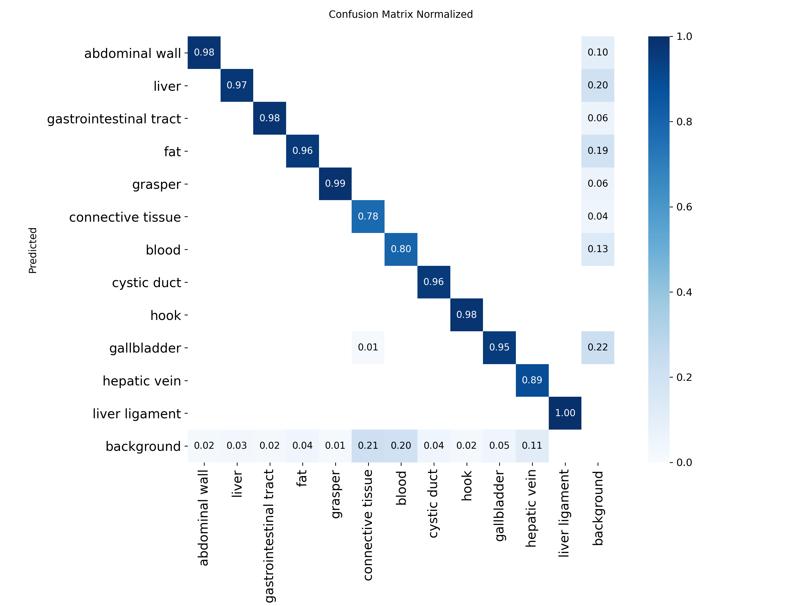
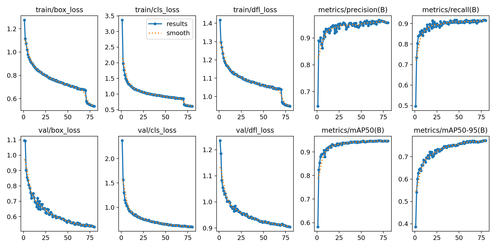
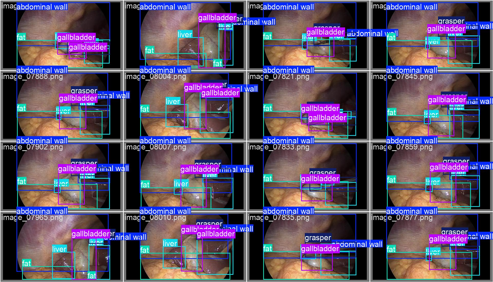
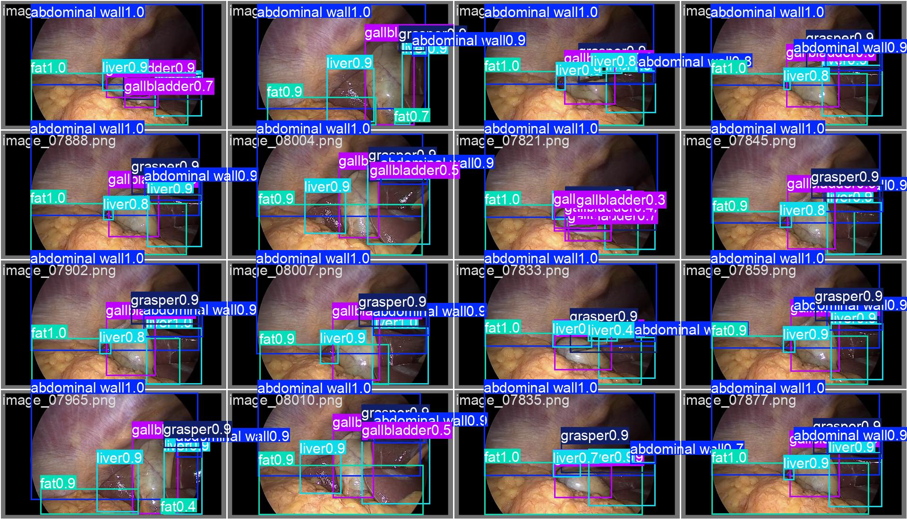

# Surgical Video Annotator

Automated bounding box annotation pipeline for laparoscopic surgery videos combining fine-tuned YOLOv8 with SAM 2 for pixel-level segmentation and tracking.

## Results Summary

Fine-tuned YOLOv8 on CholecSeg8k dataset (8080 images, 12 classes: 7 anatomical structures + 5 surgical instruments).

**Performance on held-out validation set (808 images):**

| Metric | Value |
|--------|-------|
| mAP@0.5 | **94.3%** |
| mAP@0.5:0.95 | 77.8% |
| Precision (peak) | 100% |
| Recall | 96% |
| F1 Score (peak) | 93% |

### Baseline Comparison

| Detector | mAP@0.5 |
|----------|---------|
| Zero-shot Grounding DINO | 3.4% |
| Fine-tuned YOLOv8 | **94.3%** |
| **Improvement** | **28x** |

### Per-Class Performance



All 12 classes achieved 80%+ AP@0.5:
- Liver Ligament: 99.5%
- Grasper: 99.2%
- Hook: 98.5%
- Abdominal Wall: 98.3%
- Liver: 98.0%
- Fat: 98.0%
- Gastrointestinal Tract: 97.6%
- Gallbladder: 96.1%
- Cystic Duct: 95.5%
- Hepatic Vein: 87.1%
- Connective Tissue: 83.4%
- Blood: 80.5%

### Classification Accuracy



Diagonal shows correct classification rate per class (78-100%).

### Training Convergence



## Sample Predictions

**Ground truth vs YOLO predictions on validation set:**

| Ground Truth | YOLO Predictions |
|--------------|-------------------|
|  |  |

## End-to-End Pipeline Demo

Full pipeline running on real laparoscopic cholecystectomy video (unseen source):

.jpg)

More samples: [`docs/04_video_demo/`](docs/04_video_demo/)  
Full annotated video: [`docs/04_video_demo/annotated_web.mp4`](docs/04_video_demo/annotated_web.mp4)

## The Problem

Training AI models for surgical video analysis requires large, high-quality annotated datasets. Manual annotation is extremely slow: a single laparoscopic video contains 30,000+ frames, each requiring bounding boxes and pixel-level segmentation masks.

## The Solution

A multi-model pipeline combining specialized and general-purpose models:

- **Primary detector: Fine-tuned YOLOv8** for accurate detection of surgical instruments and organs (trained on CholecSeg8k)
- **Fallback: Grounding DINO** for open-vocabulary detection of unusual items via text prompts
- **Segmentation: SAM 2** for pixel-level masks with native video propagation

## Architecture

```
                  SURGICAL VIDEO
                        |
                        v
              Smart Temporal Sampling
              (motion + scene detection)
                        |
                        v
                 Selected Frames
                        |
        ┌───────────────┴───────────────┐
        v                               v
Fine-tuned YOLOv8          Grounding DINO (fallback)
(specialized surgical      (open-vocabulary for
 instrument detector)       rare/new items)
        |                               |
        └───────────────┬───────────────┘
                        v
             Ensemble Merger (NMS)
                        |
                        v
              SAM 2 Video Propagation
              (pixel masks + tracking)
                        |
                        v
              Quality Validation
                        |
                        v
              Uncertainty Sampling
                        |
                        v
                COCO Export
                        |
        ┌───────────────┴───────────────┐
        v                               v
Streamlit Review              Active Learning Loop
```


## Key Features

1. **Multi-model detection**: Fine-tuned YOLO for accuracy + Grounding DINO for coverage
2. **Smart temporal sampling**: Adaptive frame selection based on motion/scene changes
3. **SAM 2 video propagation**: Native temporal tracking, not per-frame + IoU
4. **Rigorous evaluation**: mAP, precision, recall, F1 on labeled datasets
5. **Active learning**: Uncertainty-based sampling for human review
6. **Streamlit review interface**: Human corrections feed back to next training round
7. **Modular design**: Swap detectors, tune thresholds, disable features via config
8. **Full test coverage**: 42 unit tests for all non-ML components

## Setup

### Requirements
- Python 3.10+
- CUDA-capable GPU (8GB+ VRAM)
- ~5GB disk space (models + dataset)

### Installation

```bash
pip install -r requirements.txt

# For SAM 2 video propagation:
pip install git+https://github.com/facebookresearch/sam2.git
```

## Usage

### Complete workflow (recommended for first-time users)

Open `notebooks/03_train_and_evaluate.ipynb` in Colab and run all cells. This:
1. Downloads CholecSeg8k (8080 images)
2. Trains YOLOv8 on surgical data
3. Evaluates against Grounding DINO baseline
4. Shows side-by-side comparison

### Training YOLO on surgical data

```bash
python scripts/train_yolo.py --n-samples 8080 --epochs 80
```

### Comparing baseline vs fine-tuned

```bash
python scripts/compare_detectors.py --yolo-weights yolo_models/surgical_yolov8/weights/best.pt
```

### Running the pipeline on a video

```bash
python -m src.pipeline path/to/surgical_video.mp4
```

### Review interface

```bash
streamlit run app.py
```

## Configuration

All behavior controlled via `config.yaml`. Key settings:

```yaml
detector_type: "yolo"           # "yolo" | "grounding_dino" | "ensemble"

yolo_detection:
  weights_path: "yolo_models/surgical_yolov8/weights/best.pt"
  confidence_threshold: 0.25

detection:  # Grounding DINO fallback
  prompts: ["grasper", "hook", ...]
  box_threshold: 0.25

ensemble:
  use_dino_fallback: true
  merge_iou_threshold: 0.5
```

## Project Structure

```
surgical-video-annotator/
├── README.md
├── requirements.txt
├── config.yaml
├── app.py                          # Streamlit review interface
├── src/
│   ├── pipeline.py                 # Main video pipeline
│   ├── image_pipeline.py           # Image-mode for evaluation
│   ├── dataset_loader.py           # CholecSeg8k loader + YOLO export
│   ├── detector.py                 # Grounding DINO wrapper
│   ├── yolo_detector.py            # YOLOv8 wrapper + Ensemble
│   ├── segmentor.py                # SAM 2 per-frame segmentation
│   ├── video_propagator.py         # SAM 2 video tracking
│   ├── temporal_sampler.py         # Smart sampling
│   ├── validator.py                # Quality validation
│   ├── evaluator.py                # mAP/precision/recall metrics
│   ├── active_learning.py          # Uncertainty sampling
│   ├── exporter.py                 # COCO export
│   └── utils.py
├── scripts/
│   ├── train_yolo.py               # Fine-tune YOLOv8
│   ├── compare_detectors.py        # Baseline vs fine-tuned
│   └── analyze_results.py          # Result analysis
├── notebooks/
│   ├── 01_video_testing.ipynb
│   ├── 02_cholecseg8k_baseline.ipynb
│   └── 03_train_and_evaluate.ipynb
└── tests/                          # 42 unit tests
```

## Testing

```bash
pytest tests/ -v
```

## Author

**Subhan Saadat Khan**  
M.Sc. Data Science, FAU Erlangen-Nuremberg

Built to demonstrate end-to-end ML engineering: data pipelines, model training, evaluation, and production integration.
